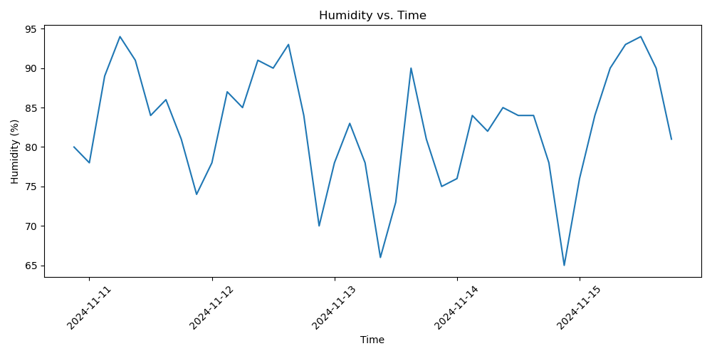
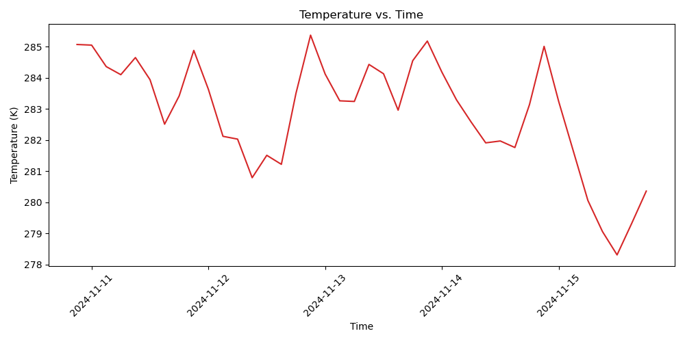
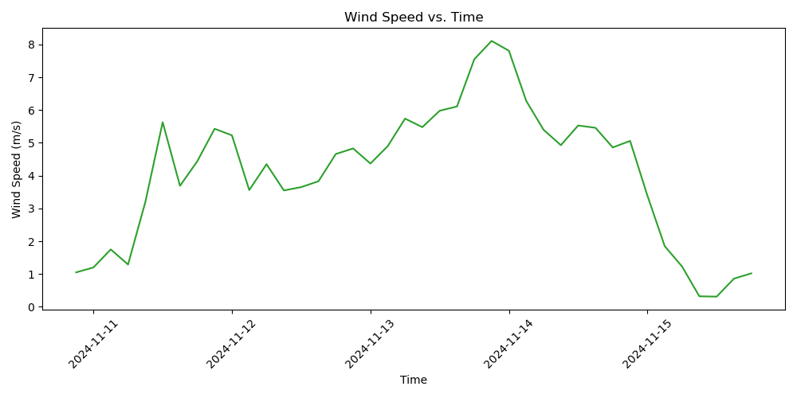
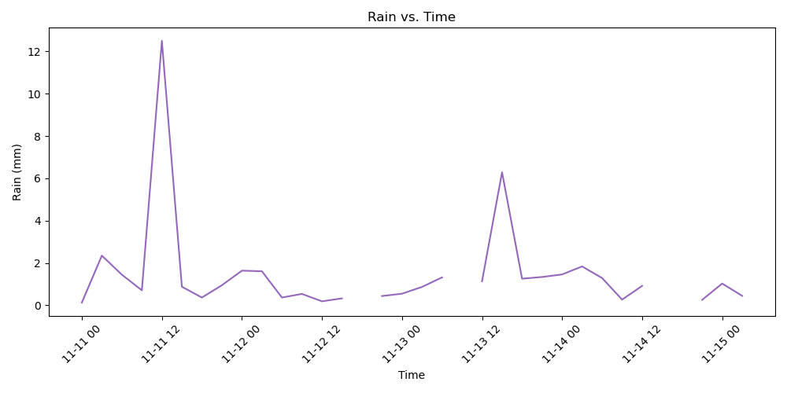
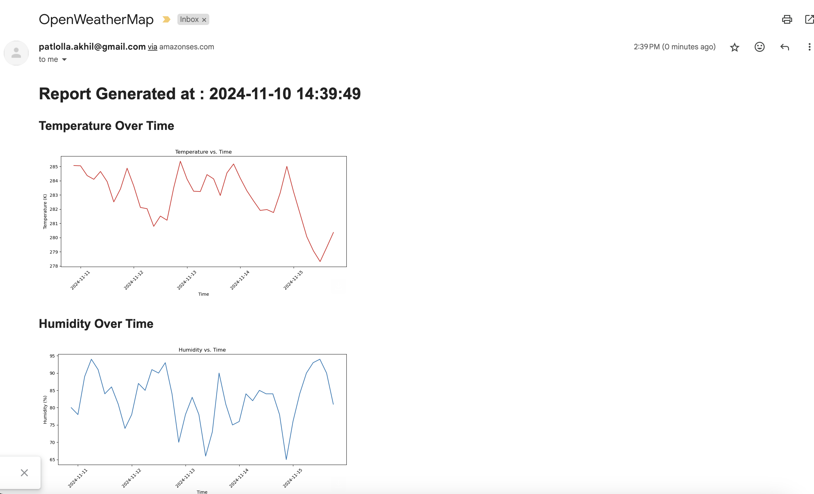

# OpenWeatherMap

This repository provides a streamlined solution for accessing the OpenWeatherMap API to retrieve real-time weather data, forecasts, and climate information. It integrates with Amazon SES to send forecasted weather updates via email, including graphical visualizations for a comprehensive data experience.

The project also leverages the AWS CDK Toolkit for efficient infrastructure deployment, utilizing CloudFormation stacks to create and manage required AWS resources:

**SSM Parameters**: Stores configuration details for secure parameter management.

**Execution Roles and Policies**: Configures IAM roles and policies to enable Lambda access to S3, SSM, and SES resources.

**Lambda Layers**: Packages essential libraries (such as pandas, matplotlib, and requests) to support data processing and visualization in Lambda functions.

**Lambda Function**: This core function sends requests to the OpenWeatherMap API based on specified latitude and longitude, processes the response data, and creates graphical representations of the forecasted weather.

The workflow is automated through an EventBridge rule to trigger Lambda at set intervals. This Lambda function generates the necessary graphs and analysis, which are then sent via Amazon SES as visually rich emails to the specified recipients.

**NOTE : Verify the email used ahead of time on the Amazon SES**

## Prerequisites
* Python 3.x installed, with the following packages:
  - pandas
  - requests
  - matplotlib
  - boto3
  
* OpenWeatherMap API Key: Sign up here to obtain an API key.
* AWS Account with appropriate permissions for:
  - AWS Lambda
  - Amazon SES
  - AWS Systems Manager (SSM)
  - Amazon S3

## Scripts :
* [index.py](Submissions/index.py)
* [akhil_send_weather_report_email.ipynb](Submissions/akhil_send_weather_report_email.ipynb)
* [weather_app-stack.ts](WeatherApp/lib/weather_app-stack.ts)

## Screenshots : 

## Email 

License
This project is licensed under the MIT License

Contact
For any questions or feedback, please feel free to reach out!
